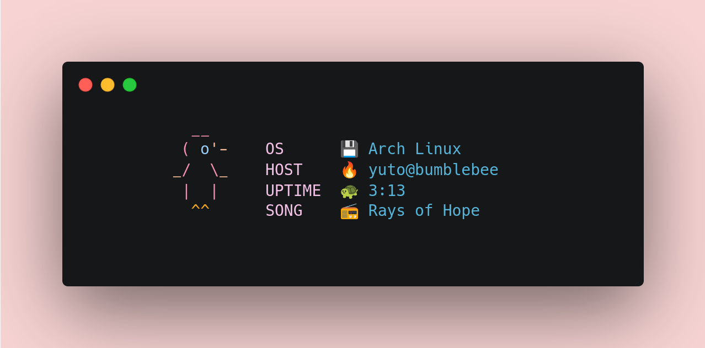

# Bumblebee

  


## About  

Bumblebee is a minial fetch for POSIX   
It's a simple command line tool that display :   
- OS  
- Host  
- Uptime  
- Song   


## Prerequisite   

*change those commands to suit your favorite package manager*  
`sudo apt install playerctl`  
`sudo apt install jq`  

## Install  


`chmod +x bumblebee`  
`./bumblebee`  

-------------------   

### In order to add it to your startup :    

*In bash :*  
```sh
echo $(pwd)/bumblebee >> ~/.bashrc
```

*In zsh :*  
```sh
echo $(pwd)/bumblebee >> ~/.zshrc
```

*In fish :*  
```sh
# in your config.fish  
function fish_greeting
	./bumblebee
end 
```


